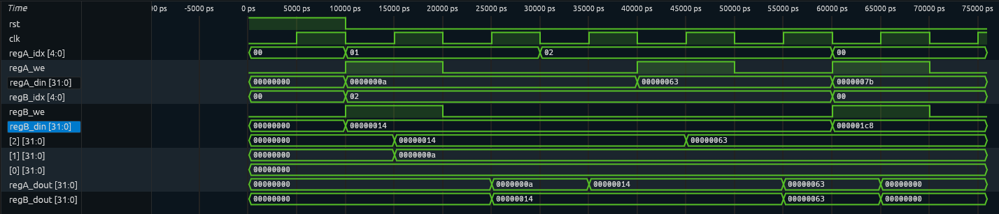
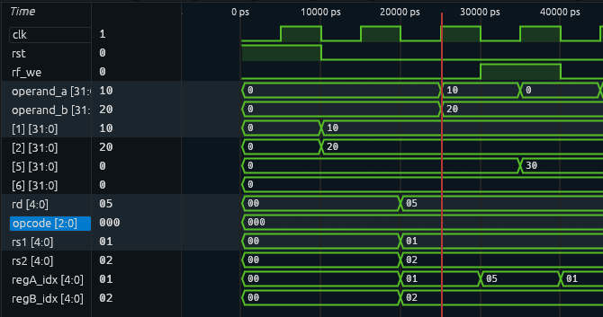
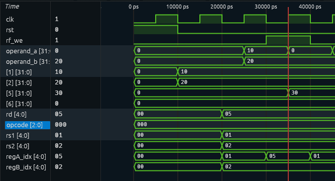
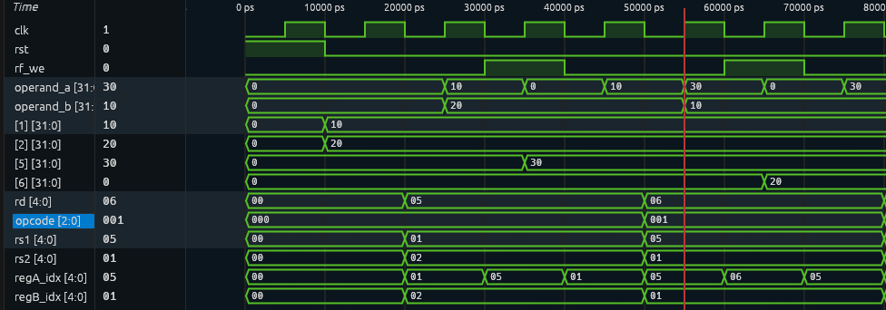
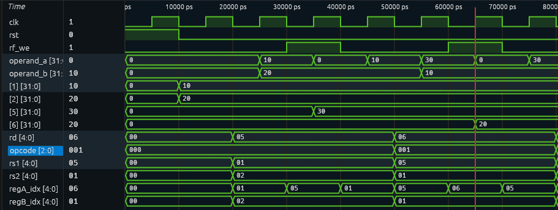
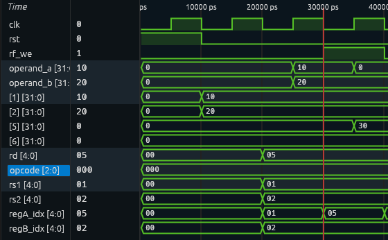
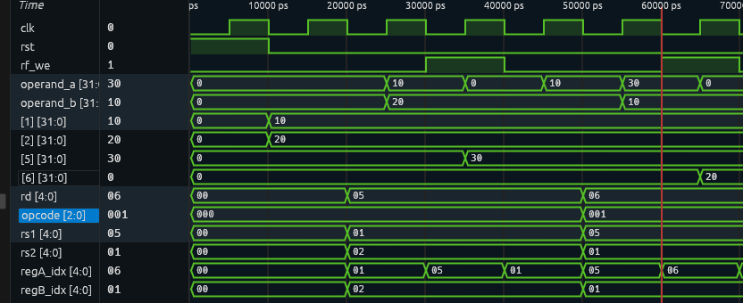
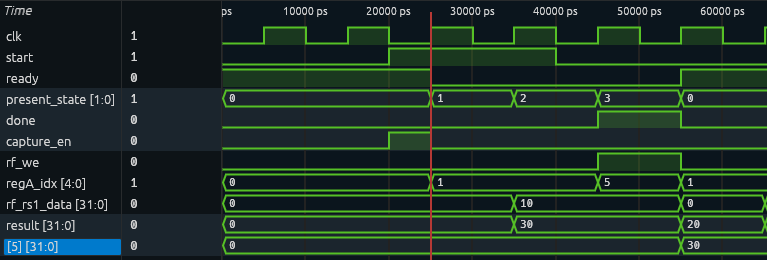
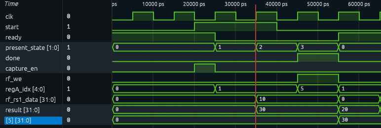
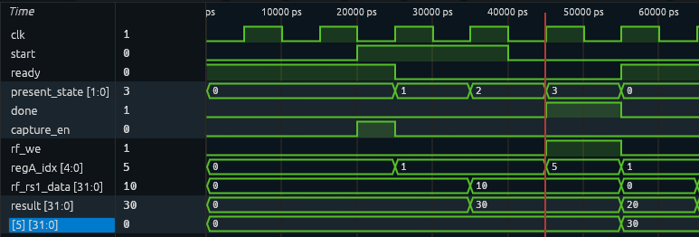

# TP1 - Respuestas

**Integrantes:**

- Lucas Dowhyj - LU 889/22
- Valentin Joven - LU 180/25
- Fermin Mayol - LU 468/25

## Ejercicio 1 - Cuentas de resultado y flags

### Resumen 

| Operación | Resultado | Z | N | C | V |
|---|---|---|---|---|---|
| 10 + 20 | 0000 0000 0000 0000 0000 0000 0001 1110 | 0 | 0 | 0 | 0 |
| 10 - 20 | 1111 1111 1111 1111 1111 1111 1111 0110 | 0 | 1 | 1 | 0 |
| 10 - 10 | 0000 0000 0000 0000 0000 0000 0000 0000 | 1 | 0 | 0 | 0 |
| 32'hFFFF_FFFF + 1 | 0000 0000 0000 0000 0000 0000 0000 0000 | 1 | 0 | 1 | 0 |
| 32'h7FFF_FFFF + 1 | 1000 0000 0000 0000 0000 0000 0000 0000 | 0 | 1 | 0 | 1 |
| 32'h8000_0000 − 1 | 0111 1111 1111 1111 1111 1111 1111 1111 | 0 | 0 | 0 | 1 |

### 1. 10 + 20

```
10:           0000 0000 0000 0000 0000 0000 0000 1010
20:           0000 0000 0000 0000 0000 0000 0001 0100
 
res=30:       0000 0000 0000 0000 0000 0000 0001 1110
```

Z:0; N:0; C:0; V:0
 
---

### 2. 10 - 20 <-> 10 + (-20)

Inverso aditivo para −20:
 
```
invierto:     1111 1111 1111 1111 1111 1111 1110 1011
+1:           1111 1111 1111 1111 1111 1111 1110 1100
```
 
```
10:           0000 0000 0000 0000 0000 0000 0000 1010
-20:          1111 1111 1111 1111 1111 1111 1110 1100
 
resta=-10:    1111 1111 1111 1111 1111 1111 1111 0110
```
 
10 < 20 → C=1
 
Z:0; N:1; C:1; V:0
 
---

### 3. 10 - 10 <-> 10 + (-10)

Inverso aditivo para -10:

```
invierto:     1111 1111 1111 1111 1111 1111 1111 0101
+1:           1111 1111 1111 1111 1111 1111 1111 0110
```
 
```
10:           0000 0000 0000 0000 0000 0000 0000 1010
-10:          1111 1111 1111 1111 1111 1111 1111 0110
 
resta:        0000 0000 0000 0000 0000 0000 0000 0000
```
 
10 < 10 ABSURDO → C:0
 
Z:1; N:0; C:0; V:0

---

### 4. 32'hFFFF_FFFF + 1

```
hFFFF_FFFF:   1111 1111 1111 1111 1111 1111 1111 1111
1:            0000 0000 0000 0000 0000 0000 0000 0001
 
res=        1 0000 0000 0000 0000 0000 0000 0000 0000
```
 
Z:1; N:0; C:1; V:0
 
---

### 5. 32'h7FFF_FFFF + 1

```
h7FFF_FFFF:   0111 1111 1111 1111 1111 1111 1111 1111
1:            0000 0000 0000 0000 0000 0000 0000 0001
 
res=          1000 0000 0000 0000 0000 0000 0000 0000
```
 
Z:0; N:1; C:0; V:1
 
---

### 6. 32'h8000_0000 − 1

Inverso aditivo para -1:

```
invierto:     1111 1111 1111 1111 1111 1111 1111 1110
+1:           1111 1111 1111 1111 1111 1111 1111 1111
```
 
```
h8000_0000:   1000 0000 0000 0000 0000 0000 0000 0000
-1:           1111 1111 1111 1111 1111 1111 1111 1111
 
res=        1 0111 1111 1111 1111 1111 1111 1111 1111
```
 
Z:0; N:0; C:0; V:1

## Ejercicio 2 - Banco de registros

Condiciones iniciales: R1 = 10, R2 = 20, lectura ya realizada con A = 1 y B = 2. 
en un flanco, todas las lecturas ven el estado previo al flanco; lo escrito se ve recién desde el flanco siguiente.

| Instante / acción | dout A | dout B | R2 |
|---|---|---|---|
| Situación inicial | 10 | 20 | 20 |
| A cambia a índice 2, antes del flanco | 10 | 20 | 20 |
| Después del siguiente flanco | 20 | 20 | 20 |
| Después de escribir 99 en R2 por A | 20 | 20 | 99 |
| Después del siguiente flanco sin escritura | 99 | 99 | 99 |


Podemos apreciar esto en el diagrama de tiempos


Al intentar escribir en R0, este registro se mantiene igual ya que se implementó que se descarten las escrituras en ese registro:

```systemverilog
// Escritura sincrónica en Puerto A y Puerto B (descarta escrituras en el registro 0)
always_ff @(posedge clk) begin
    if (regA_we && (regA_idx != '0)) begin
        rf[regA_idx] <= regA_din;
    end
    if (regB_we && (regB_idx != '0)) begin
        rf[regB_idx] <= regB_din;
    end
end
```

Y las salidas de A y B son cero en caso de que el índice sea 0, ya que también se implementó de esa manera:

```systemverilog
// Lectura sincrónica Read-First: se lee el contenido previo en regA_idx y regB_idx
// antes de que cualquier escritura modifique la posición de memoria en el flanco.
always_ff @(posedge clk or posedge rst) begin
    if (rst) begin
        regA_dout <= '0;
        regB_dout <= '0;
    end else begin
        regA_dout <= (regA_idx == '0) ? '0 : rf[regA_idx];
        regB_dout <= (regB_idx == '0) ? '0 : rf[regB_idx];
    end
end
```

## Ejercicio 3 - Camino de datos

### Operación 1: R5 <- R1 + R2 (R1=10 y R2=20)

**Lectura de operandos**



*Figura 1: flanco en el que se leen R1 y R2*

En el flanco ascendente marcado, los operandos toman los valores de los registros R1 y R2. La ALU calcula el resultado de inmediato porque es combinacional, pero todavía no se escribe en R5 porque rf_we=0.

**Escritura en el registro R5**


*Figura 2: flanco en que se escribe R5*

Con la escritura habilitada (rf_we=1), el mux pone regA_idx = rd (índice donde queremos guardar el resultado). En el flanco ascendente que cierra ese ciclo se realiza la escritura en el registro R5.

### Operación 2: R6 <- R5 - R1

**Lectura de operandos**



*Figura 3: flanco en que se leen R5 y R1*

En el flanco ascendente marcado, los operandos toman los valores de los registros R5 y R1. La ALU calcula el resultado de inmediato, pero todavía no se escribe en R6 porque rf_we=0.

**Escritura en R6**



*Figura 4: flanco en que se escribe R6*

Con la escritura habilitada (rf_we=1), el mux pone regA_idx = rd. En el flanco ascendente que cierra ese ciclo se realiza la escritura en el registro R6. 


### ¿Por  qué seleccionar rd no cambia inmediatamente el operando A de la ALU?

El operando A es la salida del puerto A del banco, que tiene lectura sincrónica: solo se actualiza en los flancos ascendentes. Cuando el mux cambia regA_idx a rd, el operando A conserva el valor leído en el flanco anterior (R[rs1]), así que la ALU sigue calculando con los operandos correctos hasta el flanco de escritura. 

En ese flanco el puerto A lee y escribe rd al mismo tiempo. Por read-first, el operando A toma el valor anterior de rd, que era 0, y por eso pasa a 0 justo después de la escritura. 



*Figura 5: operando A al seleccionar rd en la operación 1*



*Figura 6: operando A al seleccionar rd en la operación 2*


## Ejercicio 6 - Unidad de ejecución completa

Operación: R5 <- R1 + R2 (R1=10 y R2=20)

En la traza el estado se muestra como número:

| Valor | Estado |
|---|---|
| 0 | IDLE |
| 1 | FETCH_OPS |
| 2 | EXECUTE |
| 3 | WRITEBACK |

### Flanco de captura



*Figura 7: IDLE -> FETCH_OPS*

### Flanco de lectura



*Figura 8: FETCH_OPS -> EXECUTE*

### Flanco de escritura



*Figura 9: WRITEBACK -> IDLE*

### Tabla de valores 

| Estado | regA_idx | result |
|---|---|---|
| FETCH_OPS | 1 | 0 |
| EXECUTE | 1 | 30 |
| WRITEBACK | 5 | 30 |

### ¿Por qué el resultado se obtiene antes de escribirse?

Recordemos que la ALU es un circuito combinacional, el cual calcula apenas llegan los operandos (flanco de lectura). Como la escritura es sincrónica y necesita estar habilitada (rf_we=1) en un flanco ascendente, esto ocurre recién en el flanco que cierra WRITEBACK. Mientras tanto el resultado se mantiene estable porque, al pasar el mux a rd, el operando A no cambia: la lectura del banco es sincrónica y rf_rs1_data solo se actualiza en el flanco. 